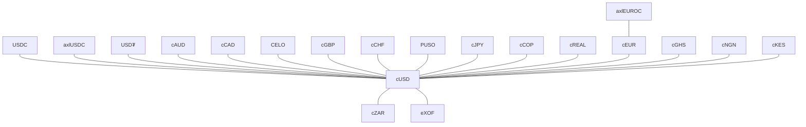

# Mento SDK

The official Mento Protocol SDK for interacting with Multi-Collateral Mento smart contracts on the Celo network.

## Installation

```sh
# Install with npm
npm install @mento-protocol/mento-sdk

# Or install with yarn
yarn add @mento-protocol/mento-sdk
```

## Learn more

You can find example usages of the SDK in the [mento-sdk-examples](https://github.com/mento-protocol/mento-sdk-examples) repository. For in-depth documentation and walk through explanations please see the [SDK section](https://docs.mento.org/mento/developers/mento-sdk) of the Mento docs.

## Tradable Pairs Cache

Anytime we launch a new stable token, we need to update the tradable pairs cache.

The `yarn cacheTradablePairs` script generates a TypeScript file containing a list of all tradable pairs on the Mento protocol. This file is used to cache the tradable pairs in the SDK and avoid costly re-fetching from the network.

```sh
yarn cacheTradablePairs
```


## Token Graph Visualization

Current token connectivity on Celo Mainnet (last updated: 2025-09-19):



**Network Stats:** 20 tokens, 19 direct trading pairs

> 💡 This graph shows direct trading pairs only. The SDK automatically finds optimal routes including multi-hop paths.
> 
> To regenerate: `yarn getTokenGraph`


